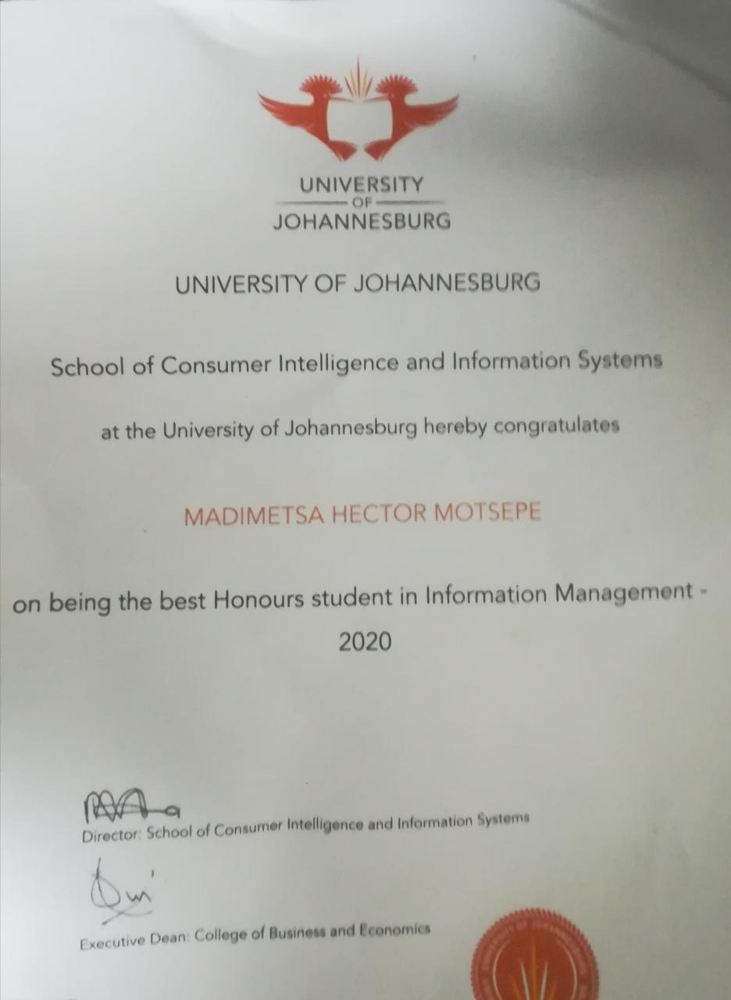

> Lastest Update: 8th Jan 2024 &nbsp; 

## Scholarships

- Jan 2021：**Huawei Masters Scholarship** (R300-000) Only Three Masters Students were selected across Engineering/ICT Faculties
- Jan 2020: **General Electric Bursary** (R150-000) Got honours bursary from GE when I was doing my Honours degree at Univeristy of Johannesburg
## Competitions (Selected)

- Coming Soon !!!

## Honors

- Dec 2020：Best Student in the Faculty  Got Best Studen for my Bachelor Degree

